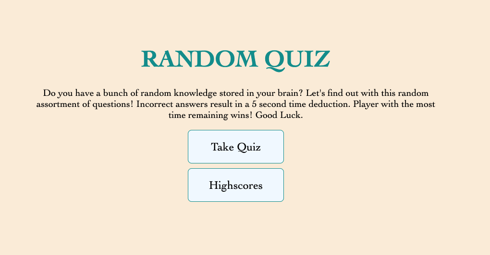
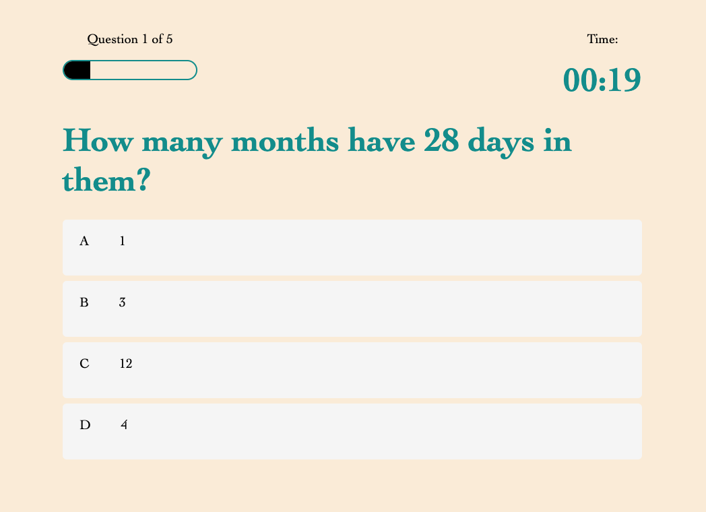
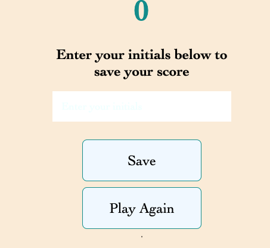
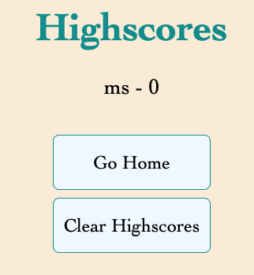

# codeQuiz
JS Homework for UCF Bootcamp 4/5/22

## Project Decscription
In this project, I built a multiple choice quiz where the timer is supposed to be your final score and decrease if you answer questions incorrectly. User should be able to save their highscore and see their initials on the highscores page as well as have the ability to clear highscores upon request. 
## Project Location
Repo Link: [RepoLink] https://github.com/Msands21/codeQuiz

Live Link: [LiveLink] https://msands21.github.io/codeQuiz/

### Contact Info
mikesands94@gmail.com

#### Project Example

